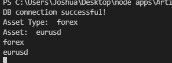
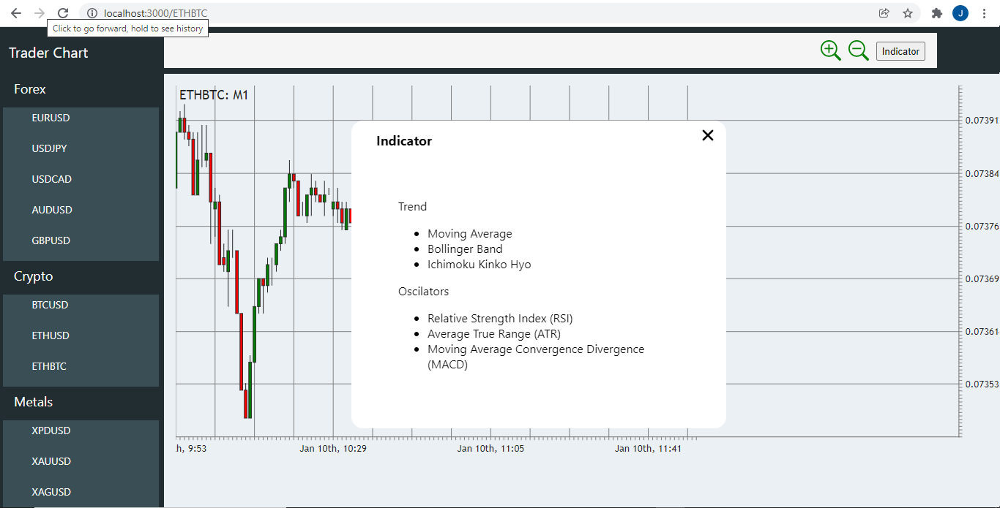

<div id="top"></div>

<!-- PROJECT LOGO -->
<br />
<div align="center">
  <a href="https://github.com/Joshuajee/Trader-Chart/">
    
  </a>

  <h3 align="center">Trader Chart</h3>

  <p align="center">
    Web Based Charting software to analyze the Forex, Stocks and Crypto Market
    <br />
    <br />
    <a href="https://trader-chart.herokuapp.com/">View App</a>
    ·
    <a href="https://github.com/Joshuajee/Trader-Chart/issues">Report Bug</a>
    ·
    <a href="https://github.com/Joshuajee/Trader-Chart/issues">Request Feature</a>
  </p>
</div>


<!-- TABLE OF CONTENTS -->
<details>
  <summary>Table of Contents</summary>
  <ol>
    <li>
      <a href="#about-the-project">About The Project</a>
      <ul>
        <li><a href="#built-with">Built With</a></li>
      </ul>
    </li>
    <li>
      <a href="#getting-started">Getting Started</a>
      <ul>
        <li><a href="#prerequisites">Prerequisites</a></li>
        <li><a href="#installation">Installation</a></li>
      </ul>
    </li>
    <li><a href="#license">License</a></li>
    <li><a href="#contact">Contact</a></li>
    <li><a href="#acknowledgments">Acknowledgments</a></li>
  </ol>
</details>


<!-- ABOUT THE PROJECT -->
## About The Project


This App is a web based trading charting platform where you can carry out technical analysis on various assets

<p align="right">(<a href="#top">back to top</a>)</p>


### Built With


* [React.js](https://reactjs.org/)
* [Mongodb](https://www.mongodb.com/)
* [Nodejs](https://nodejs.org/)
* [Express](https://expressjs.com/)
* [Victory Chart](https://formidable.com/open-source/victory/)


<p align="right">(<a href="#top">back to top</a>)</p>


<!-- GETTING STARTED -->
## Getting Started


### Prerequisites

This is an example of how to list things you need to use the software and how to install them.

* nodejs
* npm

### Installation

_Below is an example of how you can instruct your audience on installing and setting up your app. This template doesn't rely on any external dependencies or services._

1. Create A time Series collection in Mongodb [Click Here](https://docs.mongodb.com/manual/core/timeseries-collections/)
    a time series collection can only be created in a Dedicated cluster, the cluster need to be version 5.0.
    1. The collection name should be assets
    2. Set the timeField to be timeseries
    3. It should have a Metafield of symbol, category and source.
2. Clone the repo
   ```sh
   git clone https://github.com/Joshuajee/Trader-Chart.git
   ```
3. Install NPM packages
   ```sh
   npm install
   ```
4. Goto the front-end directory and Install NPM packages
   ```sh
   npm install
   ```
5. Create and Enter your Mongodb Credencial in `.env`
   ```js
   DATABASE = 'ENTER YOUR MONGODB URI'
   ```
6. Follow the steps below to populate your Collections with data:
    Note these data were gotten from MT5 as csv file then in was converted to Json format

    1. ```sh
        node upload.js
    ```
    you be prompt type `forex` for asset type and `eurusd` for asset this is case insensitive.

    

    uploading.

    

    completed.
    
    

    Note: 
    The file you are uploading should be in this directory `sampleData` the asset type should also be a directory, you should do this once per asset, Donot repeat this process.

    

    2. The data used in this app are gotten from Metatrader 5, if you want more assets download the app, export the symbol you want as csv convert into to json [https://csvjson.com/](https://csvjson.com) or with any other csv to json converter you know. 
    Then replace `<DATE>, <TIME>, <OPEN>, <HIGH>, <LOW>, <CLOSE>, <TICKVO>, <VOL>, <SPREAD>` with
    date, time, open, high, low, close, tickvol, vol, spread respectively using `ctrl h` and replace all on your text editor.

    3. if you want new `assetType` please create a new directory in the sample data directory and put the json file you want to upload, the asset name must be the asset symbole


<p align="right">(<a href="#top">back to top</a>)</p>


<!-- USAGE EXAMPLES -->
## PREVIEW

  

  


<p align="right">(<a href="#top">back to top</a>)</p>


## License

Distributed under the Apache License Version 2.0. See `LICENSE.txt` for more information.

<p align="right">(<a href="#top">back to top</a>)</p>


<!-- CONTACT -->
## Contact

Joshua Evuetapha - [@evuetaphajoshua](https://twitter.com/evuetaphajoshua) - evuetaphajoshua@gmail.com

Project Link: [https://github.com/Joshuajee/Trader-Chart/](https://github.com/Joshuajee/Trader-Chart/)

<p align="right">(<a href="#top">back to top</a>)</p>

